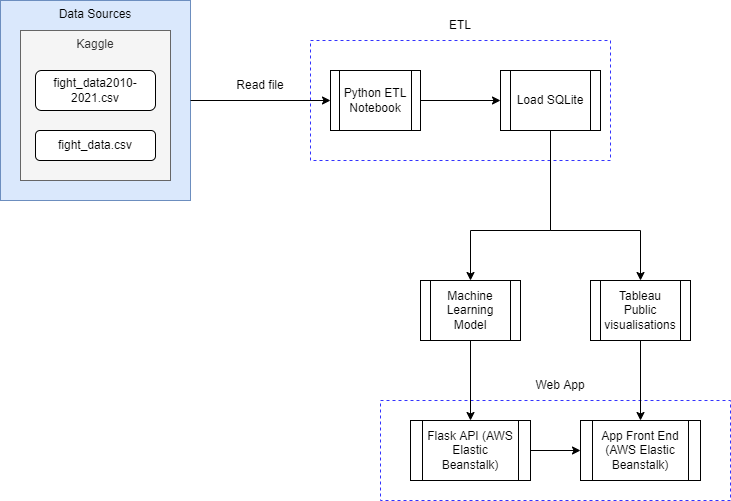

# Who is the Ultimate Fighter?

## About the Project:

The UFC (Ultimate Fighting Championship) is one of the fastest growing sports organisations in the world, earning approximately US$4.9 billion in 2021, whilst only being founded in 1993. The UFC is the largest MMA (Mixed Martial Arts) promotion in the world, with 689 fighters contracted to fight in any location in the world, so long as it holds a caged octagon. 

MMA, as its name suggests, is a hybrid combat sport which incorporates techniques from a variety of martial arts such as boxing, muay thai, karate, BJJ (brazilian jiu jitsu) and wrestling. The rules of MMA are simple; you have 3 (or 5), 5 minute rounds to fight an opponent of the same weight class. You can win via KO (knock out), TKO (technical knock-out), submission, or decision. Because there are so many different ways to win a fight, it is difficult to predict whether someone will win or lose. This is what makes this beautifully brutal sport fascinating to watch.

When fight fans talk about the best fighters in the world, a single question always arises - "Who is the pound-for-pound greatest fighter in the world?". In summary, this question aims to identify the single best fighter in the world, regardless of size. There are many different factors to consider when determining who is the greatest of all time - How many fights have they won? Who did they win against? How did they win? Can anyone else beat them?

The main aim of this project is to determine who is the Ultimate Fighter. Who is the pound-for-pound best fighter in the world? Who is the Greatest of All Time?

We will begin by training a machine learning model to predict the outcome of a fight. Using the most significant features identified from the machine learning model, we can then determine who is the Greatest Fighter of All Time.

We will also provide some fun statistics to display the diverse range of MMA athletes.

You can view the final solution [here](http://ufcprediction-env.eba-3sujs7yp.ap-southeast-2.elasticbeanstalk.com/).

## Method

We will first identify the characteristics of the best fighters in the world: 
- Fighting style
- Method of winning
- Age
- Stance (Orthodox vs Southpaw)

We will then use this information to determine who is the Ultimate Fighter? Which fighter possesses the characteristics of the best fighters in the world? 

Using the knowledge obtained from the data, we will create a Machine Learning model to predict who will win a fight.

# Model
We have tested the logistic regression model, random forest model and deep neural network to build our machine learning model.

We have used a logistic regression model to create our fight predictor as it has the highest accuracy of 63%, compared to our random forest model with 57% accuracy and deep neural network with 55% accuracy.

The model uses the following metrics:
- wins
- losses
- draw
- current_lose_streak
- current_win_streak
- avg_SIG_STR_landed
- avg_SIG_STR_pct
- avg_SUB_ATT
- avg_TD_landed
- avg_TD_pct
- longest_win_streak
- total_rounds_fought
- total_title_bouts
- win_by_Decision_Majority
- win_by_Decision_Split
- win_by_Decision_Unanimous
- win_by_KO/TKO
- win_by_Submission
- win_by_TKO_DoctoStoppage
- age
- Stance
- Height_cms
- Reach_cms

# Solution 

## Solution architecture 

The solution architecture diagram was created using: https://draw.io/




# Usage

## How to install Python requirements/dependencies
Activate your python environment, then run:

```
pip install -r requirements.txt
```
## How to run the code locally

To run the application locally, simply run 

```
cd app
python app.py
```

You should see the following which indicates that your app is running locally: 
```
* Serving Flask app 'app' (lazy loading)
* Environment: production
WARNING: This is a development server. Do not use it in a production deployment.
Use a production WSGI server instead.
* Debug mode: on
* Running on http://127.0.0.1:5000/ (Press CTRL+C to quit)
* Restarting with stat
* Debugger is active!
```

## How to deploy the code to your web hosting service 

### Deploy ETL to AWS Elastic Beanstalk 

#### Build app

Before we can deploy the app, we need to first build the app. 

Building the app refers to packaging and compiling the app so that it is in a state that can be readily deployed onto the target platform (e.g. AWS, Heroku, Azure, GCP, etc). We can skip the compilation since Python is not a compiled language, however we still need to package the app. 

To package the app, we will run the following lines of code: 

<b>macOS</b>:
```
zip -r web-app.zip templates static
zip -g web-app.zip app.py prediction.py requirements.txt Procfile
```

<b>windows</b>:

Note for Windows-only - You will need to install 7z (7-zip) which is a command line tool used for zipping files. 

1. Go to https://www.7-zip.org/ and download the version for your windows PC (usually 64-bit x64)
2. Run the installer .exe file 
3. Add the path `C:\Program Files\7-Zip` to your environment variables `path` 

```
7z a -tzip web-app.zip templates static
7z a -tzip web-app.zip app.py prediction.py requirements.txt Procfile
```

This will produce a `.zip` file which contains all the code and library packages required to run the app on AWS Lambda.  

For re-use, we've stored the commands in [build.sh](app/build.sh) and [build.bat](app/build.bat) respectively. 

You can just build the app by running either 

<b>macOS</b>:
```
. ./build.sh
```

<b>windows</b>:
```
build.bat
```

#### Deploy app

1. In the AWS Console, search for "Elastic Beanstalk". 
2. Choose the region closest to you on the top-right e.g. Sydney (ap-southeast-2)
3. Select "Create Application" 
4. Configure ELB. Note: Unless specified, leave the settings to default. 
    1. Provide the application name 
    2. Select Platform: "Python"
    3. Select Platform Branch: "Python 3.8 running on 64bit Amazon Linux 2"
    4. In the "Application code" section, select "Upload your code"
        - Select "Local file" > "Choose file" and select the `.zip` file you have built 
    5. Select "Configure more options" 
        1. Select "Capacity" > "Edit" 
            - Under "Instance types", ensure that only "t2.micro" is selected. 
            - Select "Save" 
    6. Select "Create app" 